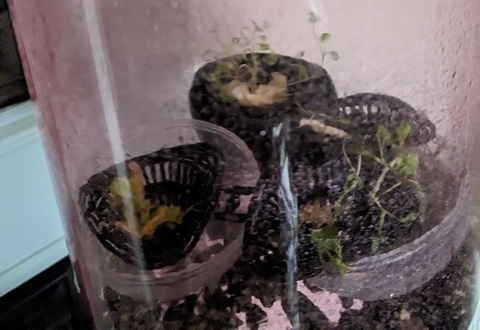
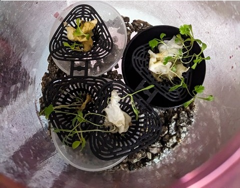
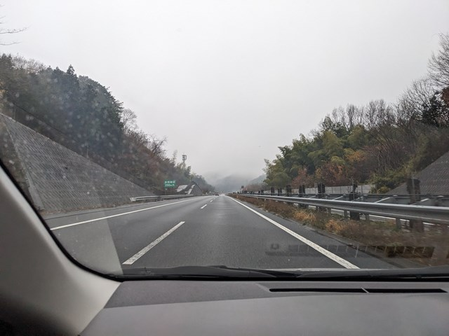
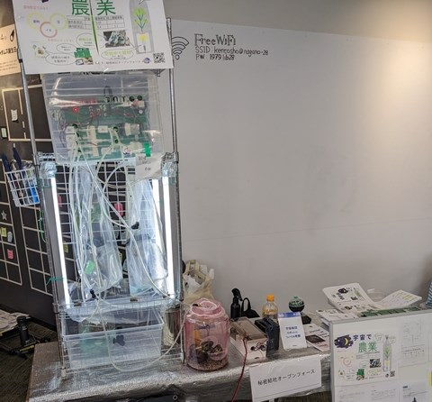
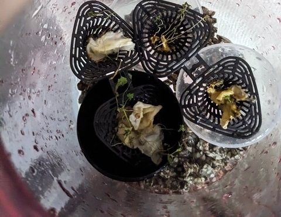
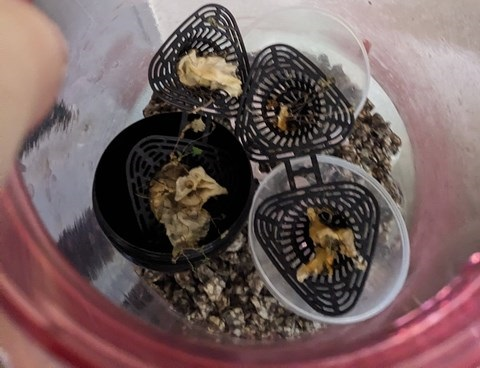
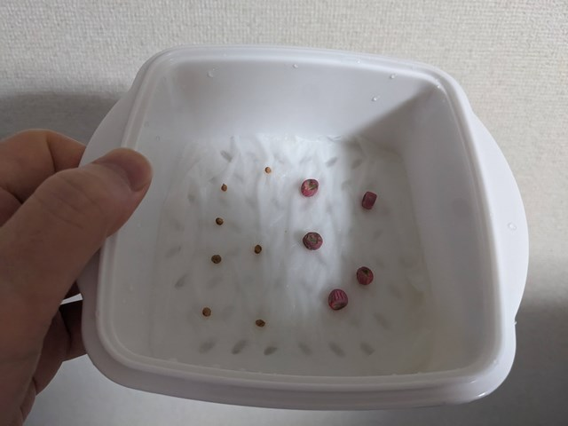
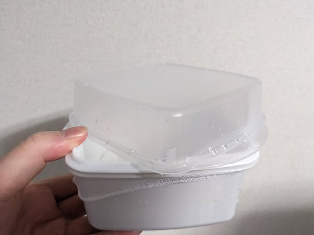

# アブストラクション
秘密結社オープンフォースでの総統(@nanbuwks)指揮による今までの活動として、

宇宙栽培試行のための閉鎖空間内豆苗栽培と栽培ロボット運用記 (https://github.com/busyoucow/SpaceToumyou) では、人間の手による管理で豆苗を水耕栽培を行い、

宇宙栽培試行のための栽培ロボット起動及び構造物と配管組み上げ記録 (https://github.com/busyoucow/SpaceRobotFarmTest01) では、総統より供与された栽培ロボットの組み立て及び動作確認を行った。

そして実際に食用植物を総統提供の栽培ロボット (https://qiita.com/nanbuwks/items/37bffef16036937eecc3) を使用して実際に育成しその経過観察を行い
一定の結果 (https://github.com/busyoucow/SpaceToumyouRobot) をみた。

今回は発芽種子の搬送試験を試行し発芽種子の状態観察をしていく。

# はじめに
この記事は植物種子の発芽試験結果を栽培地関東から長野で行われたイベントへ往還長距離搬送したのちに枯れてしまった観察記録を記すものである。

# 発芽した芽をイベントに搬送

発芽した種子の搬送前の様子。

この時点では元気に育っている。

オープンフォース総統の運転する車に同乗して一路長野へ。

長野県にて12月14日に行われた「モノコトフェス」に出展した際の様子。
テーブルに乗っているピンクの瓶が発芽した種子である。

# イベント搬送後…

12月14日イベント当日に帰還した直後の発芽したパクチーとチンゲンサイの種子。まだ元気そうに見えるが…

12月21日にはかなり弱っている。
低温のせいかもしれないが7日間でかなりダメージがある様子だ。

12月26日の様子。もはや生気は感じられない。
12月21日から5日間経過で完全に枯れてしまった。残念ながらクリスマスは越えられなかったようだ。
ここで記録を終了する。

# 何故芽は枯れてしまったか考察

## 物理ダメージ
このピンク栽培瓶は元々果実酒用プラ瓶だったため、取っ手つき密閉蓋が付属しており、その蓋を使用して安全に持ち運べたと考えていた。

しかし発芽した芽は瓶内部のカプセルの中にプラ製根保持器具を使用して根を張っていた。
そのため実際には傾斜や振動、転倒などのダメージを受けていた可能性がある。
事実荷物と共に後部座席や座席下に置いていたが傾いたり転がってしまったこともあった。

また展示機材の多くを持参したため、荷物の取り回しや荷物同士及び徒歩移動時の衝突ダメージも無視できないだろう。

## 乾燥ダメージ
乾燥対策としては一日の間、輸送中やイベント中は霧吹きでハイポネックス同等品入り水を使い適度に湿らせていた。
輸送中は密封状態であり時々蓋を開けて内部に水滴がつくほど湿らせていたため特段問題があるようには考えられない。

実際イベントから帰還直後の様子では乾燥しているようには見えない。

## 温度ダメージ
イベント日の12月14日は出発地関東でもイベント開催地長野でも雪が降っていた様子はなかった。
また気温も関東で3.1度～8.5度、長野で1.1度～7.1度である。

移動経路は徒歩と鉄道も使用しているが主に乗用車でありそこまで低温であったとは考えにくい。
イベント会場も屋内の図書館であり特に寒いわけではないように感じた。

その後12月26日まで栽培地関東の気温を見たが、最低気温が14日を下回る日はなかった。

# 枯れないために取りうる対策
ここまで見て、やはり物理ダメージを軽減する事が必須であるように感じる。
プラ製根保持器具をピペットラックのようなもので固定することや
転倒対策として荷物同士を固定すること。
また中途半端に成長した芽を持参せず、発芽当初の芽（根や茎があまり伸びていないため折れにくい）か
苗まで成長（多少の振動では折れない）した個体を搬送するべきであった。

この記録をもとに安全に搬送ができるよう考えていきたいと思う。

# 次のイベントに向けて
次は3月14日の東京とびもの学会へつるありスナップと早どりほうれん草の発芽した芽を持参する予定である。

持参する芽はまだ発芽したばかりのものであり
また容器に直接濡れティッシュを敷いて種を蒔いておりそこまで成長していない。

容器には蓋も付属しているため落下転倒さえ気を付けていればダメージは少なくなると考える。
オープンフォース総統に相談して共に持参する機材を減らし、荷物同士の取り回しや衝突による振動ダメージも減少させようと考えている。

うまくいけば今後は早どり小松菜やしそ大葉も試していこうと考えている。

# おわりに
曲がりなりにも生体搬送のため細心の注意をはらっていきたいが、現実の制約があるため実際にどこまで軽減できるかはこれからも検討していかないといけないだろう。
当方運転免許もワゴン車もないため、如何に安全な輸送ができるかは試行錯誤の必要があるだろう。
