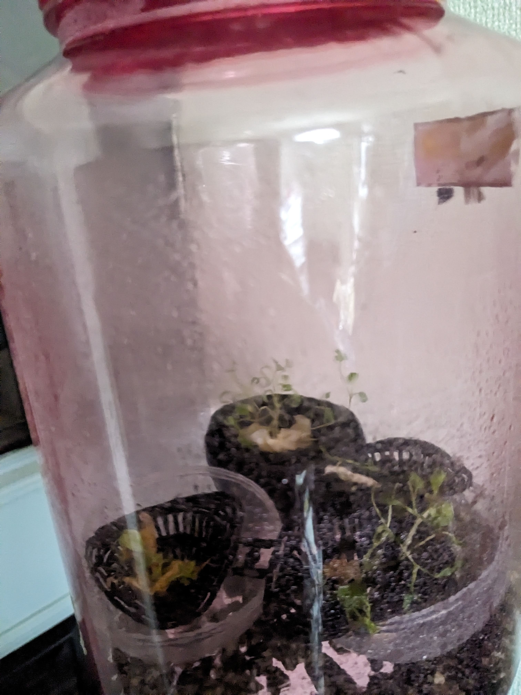
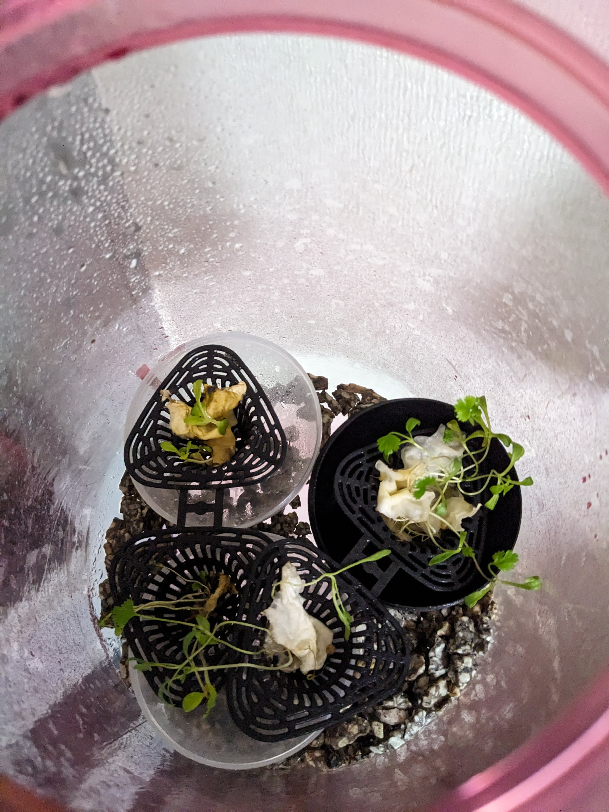
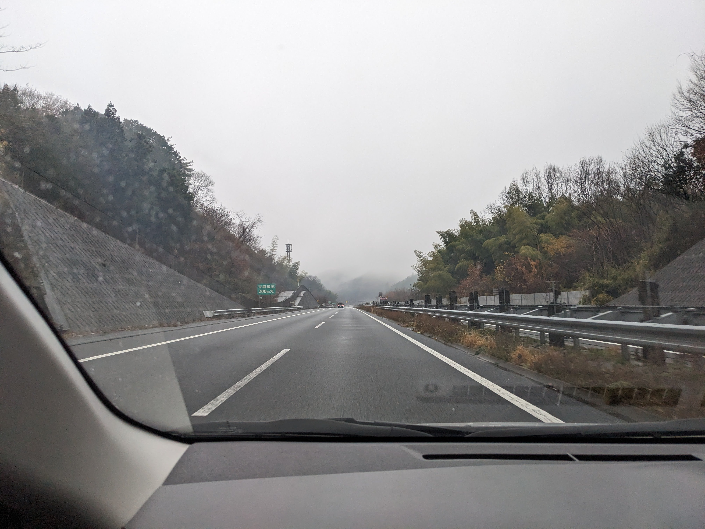
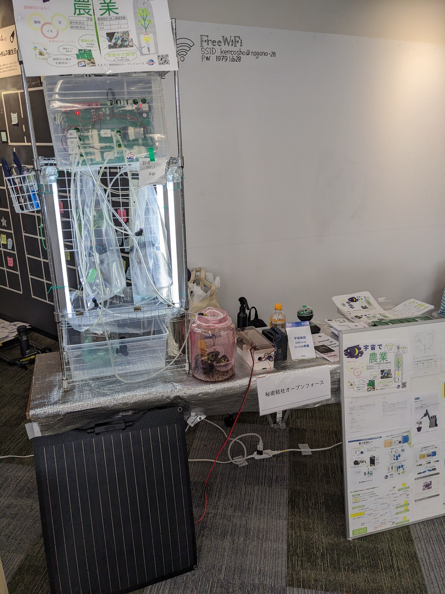
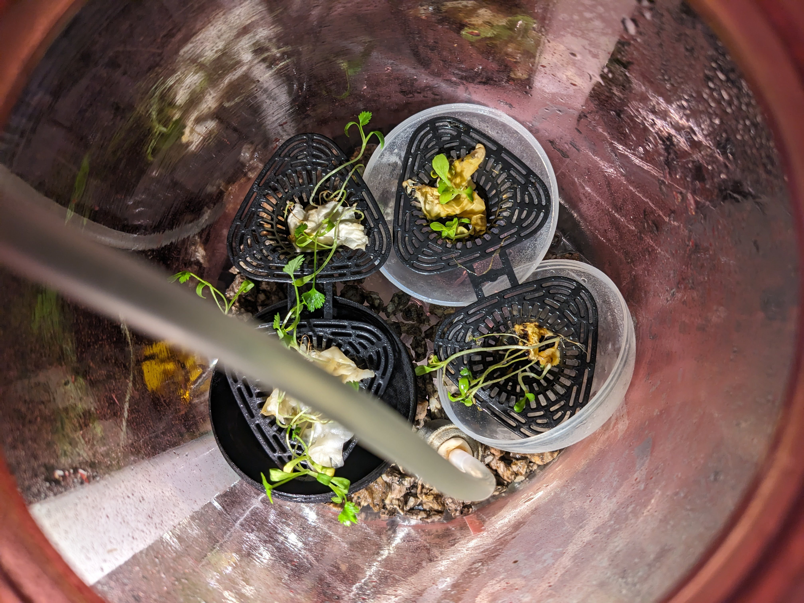
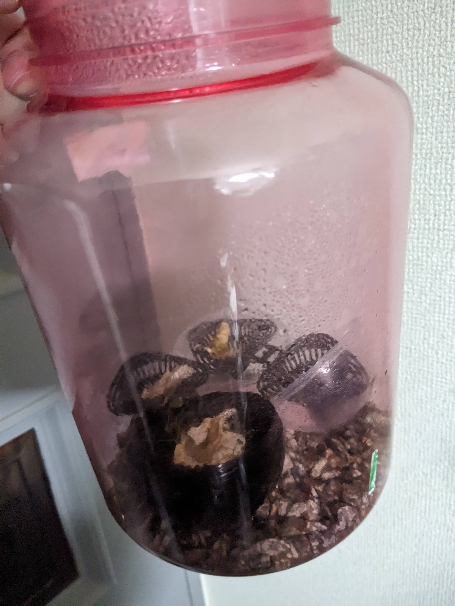
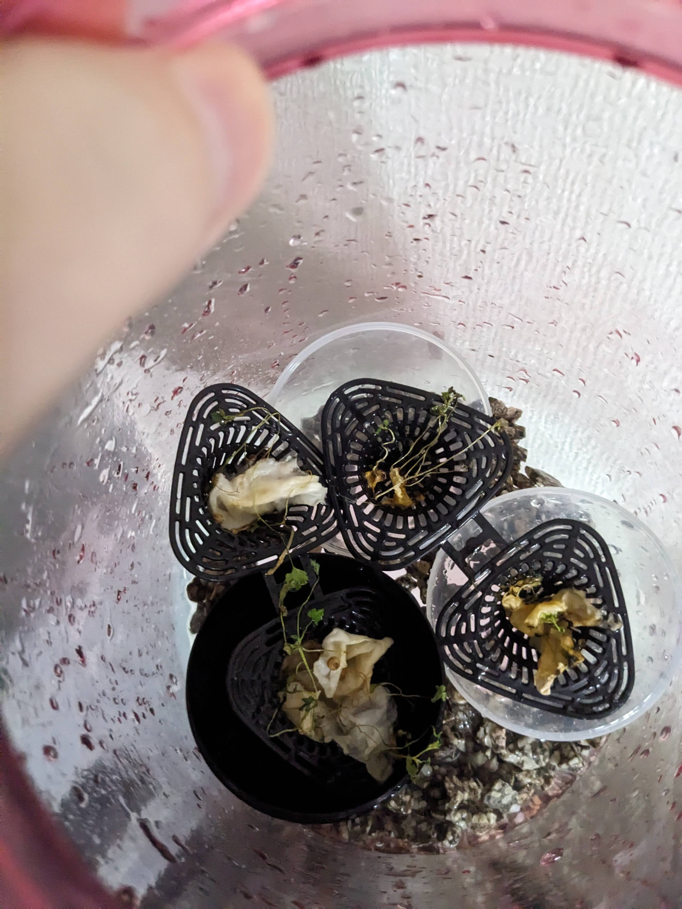
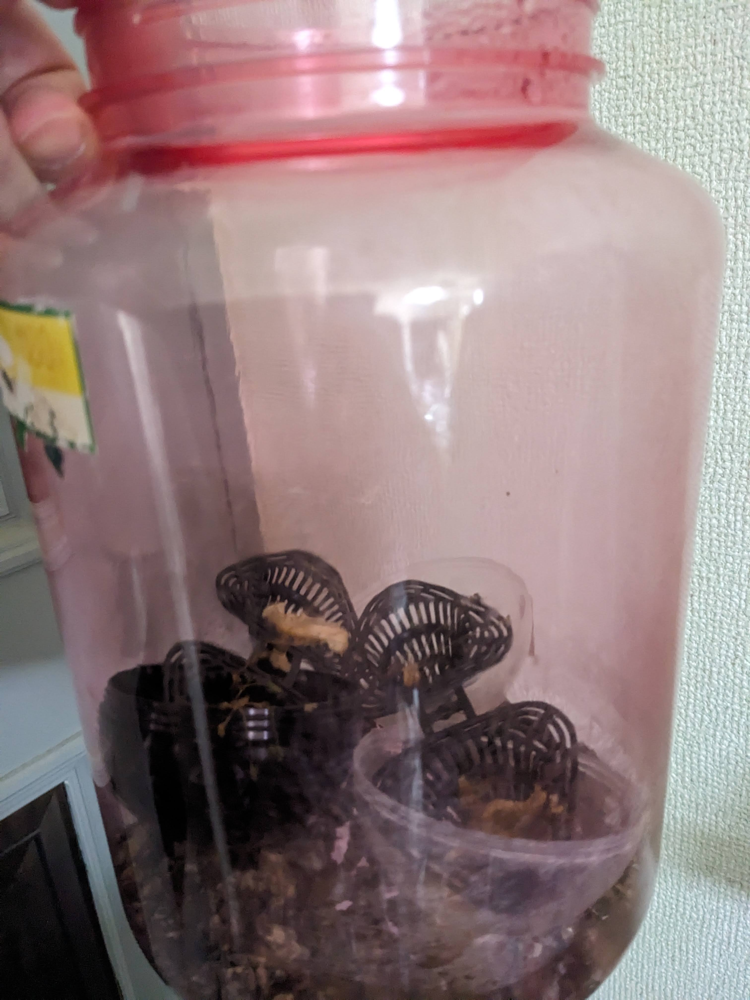
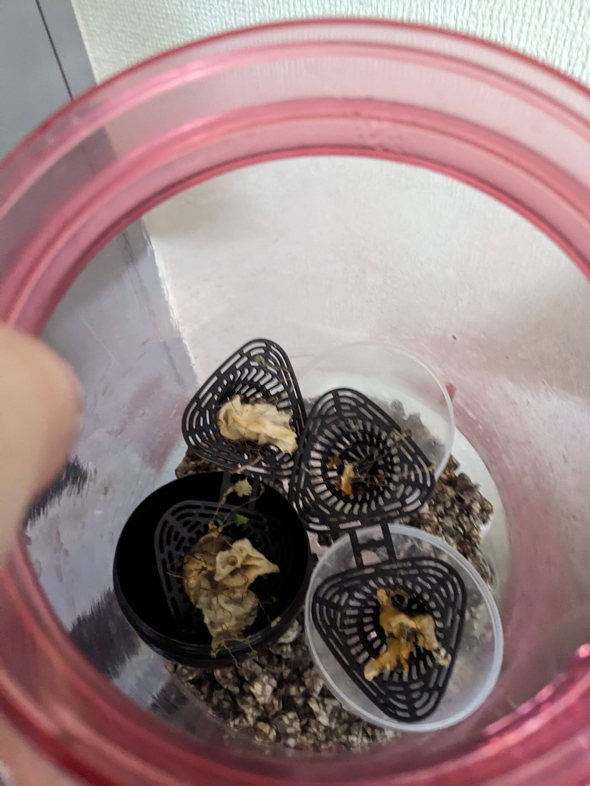

# アブストラクション
秘密結社オープンフォースでの総統(@nanbuwks)指揮による今までの活動として、

宇宙栽培試行のための閉鎖空間内豆苗栽培と栽培ロボット運用記 (https://github.com/busyoucow/SpaceToumyou) では、人間の手による管理で豆苗を水耕栽培を行い、

宇宙栽培試行のための栽培ロボット起動及び構造物と配管組み上げ記録 (https://github.com/busyoucow/SpaceRobotFarmTest01) では、総統より供与された栽培ロボットの組み立て及び動作確認を行った。

そして実際に食用植物を総統提供の栽培ロボット (https://qiita.com/nanbuwks/items/37bffef16036937eecc3) を使用して実際に育成しその経過観察を行い
一定の結果(https://github.com/busyoucow/SpaceToumyouRobot)をみた。

今回は発芽種子の搬送試験を試行し発芽種子の状態観察をしていく。

# はじめに
この記事は植物種子の発芽試験結果をイベントへ長距離搬送したのちに枯れてしまった観察記録を記すものである。

# 発芽した芽をイベントに搬送

発芽した種子の搬送前の様子。

この時点では元気に育っている。

オープンフォース総統の運転する車に同乗して一路長野へ。

長野県にて12月14日に行われた「モノコトフェス」に出展した際の様子。
テーブルに乗っているピンクの瓶が発芽した種子である。

# イベント搬送後…

12月14日イベント当日に帰還した直後の発芽した種子。まだ元気そうに見えるが…

12月21日にはかなり弱っている。

低温のせいかもしれないが7日間でかなりダメージがある様子だ。

12月26日の様子。もはや生気は感じられない。

更に5日間経過で完全に枯れてしまった。残念ながらクリスマスは越えられなかったようだ。
ここで記録を終了する。

# おわりに

瓶に付属の蓋をして安全に持ち運べたと考えていたが、実際には傾斜や振動、転倒などのダメージを受けていたのかもしれない。
また輸送中やイベント中は霧吹きで適度に湿らせていたが枯れてしまった。
この記録をもとに安全に搬送ができるよう考えていきたいと思う。
